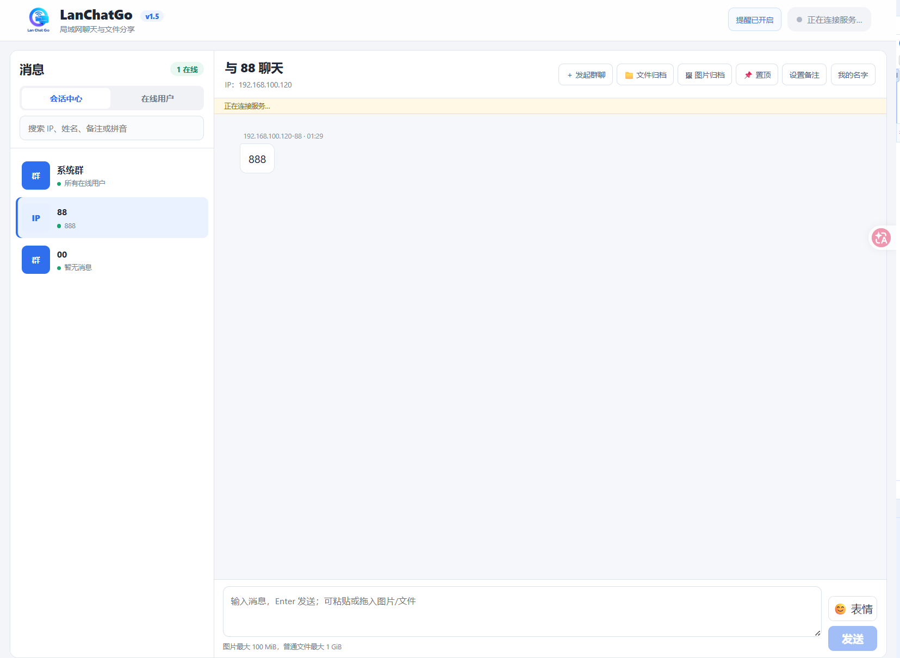
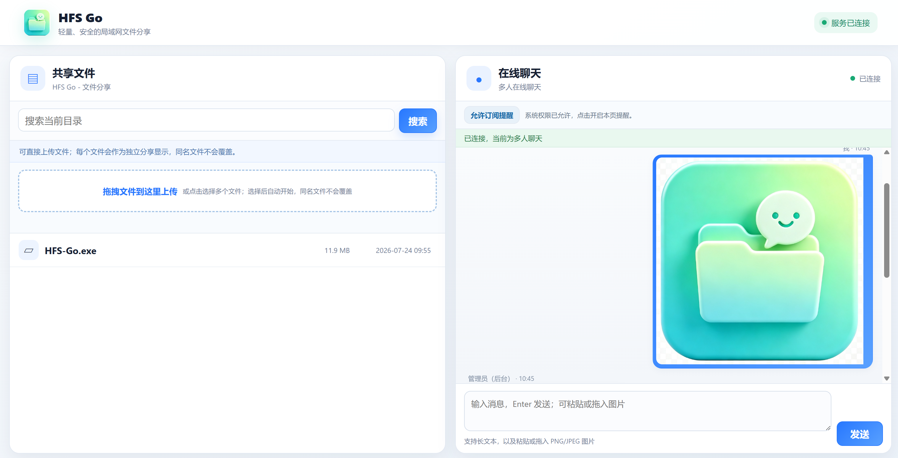

# TinyChatGo

> Linux / NAS 无界面服务端现已支持，部署方法见 [docs/linux-nas.md](docs/linux-nas.md)。

TinyChatGo 是轻量、安全的互联网聊天与文件分享系统。`TinyChatGoServer`（简称 **TCGS**）负责账号、权限、群聊和历史归档管理；用户登录后可通过浏览器、Windows、macOS 或 Android 客户端使用。

[下载 TinyChatGo v1.1.4](https://github.com/aceggbond/TinyChatGo/releases/tag/v1.1.4) · [Releases](https://github.com/aceggbond/TinyChatGo/releases) · [项目主页](https://github.com/aceggbond/TinyChatGo)

## 主要功能

- 微信 ClawBot：每个用户可独立扫码绑定自己的微信，在固定首个会话中与微信双向发送文字、图片和文件；可把 TinyChatGo 私信转发到微信，管理员可查看绑定状态并强制解绑。
- 用户名和密码注册、登录，密码使用 Argon2id 哈希保存，登录状态使用 HttpOnly Cookie。
- 可选“新用户需要管理员审批”，后台可批准、拒绝、禁用、删除账号及重置用户密码。
- 可选 Web 首层访问密码；桌面客户端可以在编译时内置服务端地址和访问密码。
- 实时私信和自建群聊，支持群主管理、成员退出、会话置顶、静音、未读数、已读回执和两分钟内撤回。
- 支持头像、备注、`@用户`、超链接确认跳转、代码块、Microsoft Fluent 3D 表情和骰子。
- 支持粘贴或拖入图片/文件，附件进入待发送区后再确认发送；图片最大 100 MiB，普通文件最大 1 GiB。
- 图片支持放大、前后切换、滚轮缩放和 `Esc` 退出；聊天文本、图片和文件均支持右键复制。
- 文件和图片自动归档、搜索和分页；附件使用 SHA-256 去重，相同内容只保存一份。
- Windows 客户端支持开机启动、托盘驻留、声音、任务栏及托盘闪烁、带发送人头像的通知。
- macOS ARM64 客户端支持 Apple Silicon、菜单栏驻留、系统通知、自签名 HTTPS、原生文件选择和系统下载。
- Android 客户端内置固定服务地址，首次输入的首层访问密码由 Android Keystore 加密保存；采用微信式“消息、通讯录、我的”底部导航，支持全屏聊天、文件选择、带登录 Cookie 的系统下载，以及前后台连接交接、断线恢复、开机启动的常驻消息通知服务。
- 支持 HTTP/HTTPS、自动生成证书、HTTP 跳转 HTTPS，以及可信代理、X-Forwarded-For 和 PROXY Protocol v1/v2。
- 配置、账号、会话、聊天记录、归档索引和证书统一保存在 `tinychatgo.db`。

## 界面预览

### TCGS 服务端



### 浏览器聊天端



## 使用

1. 从 [Releases](https://github.com/aceggbond/TinyChatGo/releases) 下载并运行 `TinyChatGoServer.exe`。
2. 在设置中选择监听地址和 HTTP/HTTPS 端口，并配置注册审批、群聊、私信、客户端下载及可信代理。
3. 启动服务，将显示的访问地址提供给用户。
4. 用户注册并登录后即可聊天；开启审批时，需要管理员批准新账号。

`Alt+F4` 会退出服务端；点击窗口关闭按钮会隐藏到系统托盘。程序使用 `logo.png` 作为窗口、托盘和浏览器图标。

## 数据与部署

- `tinychatgo.db` 不存在时会自动创建；聊天附件保存在 `chat_files/`。
- 互联网部署应启用 HTTPS，并设置足够强的 Web 访问密码与账号密码。
- 经过 FRP 或反向代理时，在服务端填写可信代理 IP/CIDR；HTTP 代理可传递 `X-Forwarded-For`，TCP 映射可启用 PROXY Protocol v1/v2。
- `internal/appinfo/appinfo.go` 中的 `ClientServerURL` 和 `ClientAccessPassword` 会编译进桌面客户端。

## 从源码构建

需要 Go 1.20 或更高版本：

```powershell
go test ./...
go build -trimpath -buildvcs=false -ldflags "-H=windowsgui -s -w" -o TinyChatGoServer.exe .
go build -tags client -trimpath -buildvcs=false -ldflags "-H=windowsgui -s -w" -o TinyChatGo-Client-windows-amd64.exe .
```

推送版本标签后，GitHub Actions 会构建：

- `TinyChatGoServer.exe`
- `TinyChatGo-Client-windows-amd64.exe`
- `TinyChatGo-Client-macos-arm64.zip`

## 项目地址

https://github.com/aceggbond/TinyChatGo

<p align="center">
  
</p>
